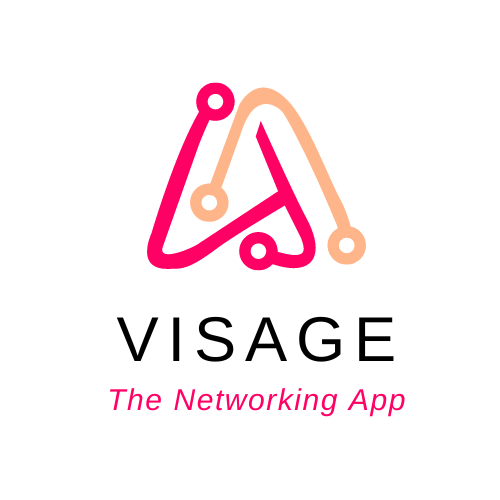

# Visage

 
The ultimate networking app designed from the ground up to help you find new people with similar interests as you and form fruitful connections that help propel you in your career.
 
 

# [See the App in action! (YouTube Video)](https://youtu.be/fDX-1QZa8h0)

<!-- # [Try it out!](http://ec2-3-144-14-18.us-east-2.compute.amazonaws.com:3001/)

[Try out the app by clicking this link!](http://ec2-3-144-14-18.us-east-2.compute.amazonaws.com:3001/)
- Click "register" to create an account, and start connecting with people! -->

# How does it work?
When you create your Visage account, we ask you to share a few details about you such as your career interests, the organizations you have been a part of before, your skills, the organizations you have been a part of thus far, etc and suggest five people at a time who we think would be a great connection for you. You can accept or decline these suggestions, and we will learn to provide you better suggestions based on what you pick.

Once you accept the suggestion, you and the suggested person will be added as a connection and you can message each other though Visage.

# Technical Details

## Tech Stack

| What     | technology                         |
| ----     |  ------------------------------    |
| Frontend | React.js                           |
| Backend  | Node.js                            |
| Database | MySQL on AWS RDS                   |
| Hosting  | AWS EC2                            |

## How to run the application on your local env
1. Install MySql. If you use a password, please edit `./index.js` as needed.
2. Install MySql workbench
3. Run the MySql scripts in `./database-scripts` to create the necessary tables (optional: and easily create some sample records).
4. Run `./run-app.sh`

## File Structure

`./server`
- `authentication`: Contains controllers needed for authentication, user creation, input verification, etc
- `connections`: Contains controllers needed to manage Suggested and actual connections.
- `messaging`: Contains controllers needed to send and receive messages to/from connections in Visage.
- `userInfo`: Contains controllers needed to get and update information about each user

`./visage-app/src`
- `custom-components`: Contains all the custom React components made for Visage.
- `pages`: Contains each "page" of the React App.

## Endpoints

 Name                  | What 
 --------------------- | ------------------------------
**User Info and Authentication**    | --- 
`/userStats`                        | GET request for user stats
`/getProfile`                       | GET request to get a user's profile 
`/createUser`                       | POST request to create a user account
`/updateProfile`                    | POST request to update a user's profile 
`/getEmail`                         | GET request to get a user's email 
`/updateLogin`                      | POST request to update a user's login info 
`/login`                            | POST request to login a user 
`/logout`                           | POST request to logout a user 
`/isUniqueEmail`                    | GET request to check if an email is unique 
--- | ---
**Messaging**   | ---
`/getMessages`  | GET request for all the messages between two users 
`/sendMessage`  | POST request to send a message to a user 
--- | ---
**Connections**             | --
`/getExistingConnections`   | GET request for all the connections of a user 
`/getSuggestedConnections`  | GET request to the connection suggestions created by us for the user 
`/removeConnection`         | POST request to remove a connection 
`/declineSuggestion`        | POST request to decline a suggested connection

## "The Algorithm"

### Problem
To be able to create valuable connection suggestions, the goal is to eventually use a quick-learning Un-supervised machine learning algorithm such as K-means clustering. But obviously, to be able to train a machine learning model, you need data and I don't really have any right now... 

### Solution
I made a quick cut-price clustering algorithm that works well enough for the purposes of this application--I made a distance function that computes a similarity score between the active user and every other Visage user based on the attributes we have about them (like career interests, skills, hobbies, etc). Higher the similarity score, the more similar the two users in question are. When a new connection suggestion has to be made, we simply return the connection with the highest similarity score that hasn't already been suggested to the user.

## Cyber Security Measures

Disclaimer: While I have taken a lot of measures to ensure that Visage is secure, I am not a cyber security expert, and I don't provide any guarantees that Visage is a 100% secure. If you find any vulnerabilities, please let me know.

### SQL injection
All SQL statements run by the server is parameterized--i.e no hacker provided query will be run.

### Access Control 
Essentially to prevent something like the [Moon Pig security bug](https://www.theguardian.com/technology/2015/jan/06/personal-details-moonpig-exposed-security-bug) from occurring with Visage.

- Every user is assigned a random, unique userID from a very large range. This UserID is only for identification.

- At every login, the user is assigned a random, unique, single-use per session session ID from a very large range. This session ID is what is used to identify the user throughout their session. At each and every request, the server verifies that session ID and the user ID associated with each request match before executing anything else.

- So basically, a malicious actor would have to guess two completely random numbers from a very large range of numbers (the number of digits could even be different!) to do something malicious which is unlikely.

### Password

Right now, users' password are transmitted as plain text upon login and user creation (and in no other case)... While this should be fine as long as the connection is SSL encrypted, it is definitely not ideal. So one of the next steps for Visage is to do away with passwords entirely (on our side at least) and implement 3rd party login. (Example: Login with Google)

## Future Plans
1. Make the UI more mobile friendly. 
   
2. It is a lot easier and secure for Visage and for Visage's users if we use a 3rd party login service. So I am planning to use login via Google and not deal with passwords on my own. 

3. Once I get this hosted and get a few people using Visage, I plan to switch to a proper clustering algorithm for scalability and better connection suggestions.

4. Explore options to enable HTTPS on the server.
